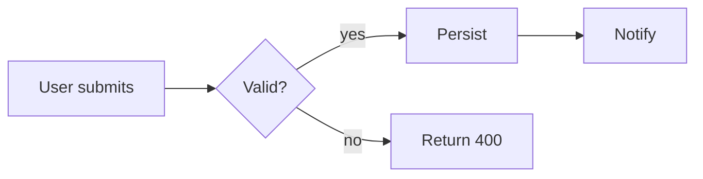
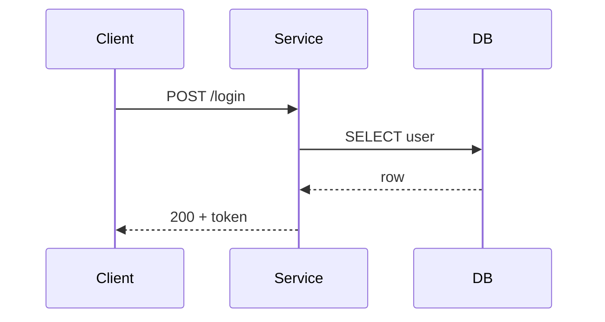
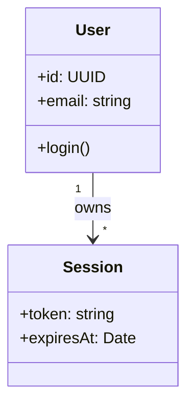
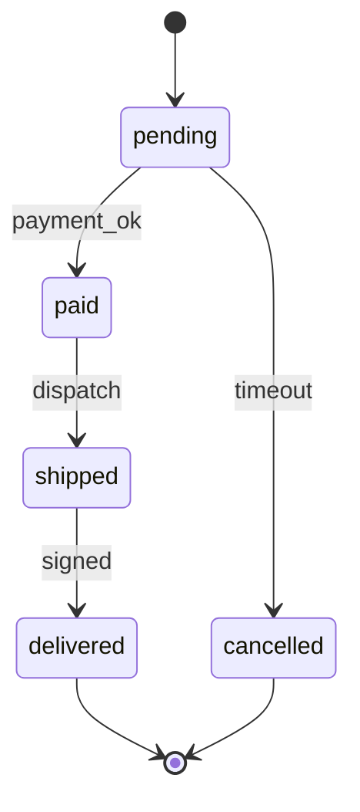
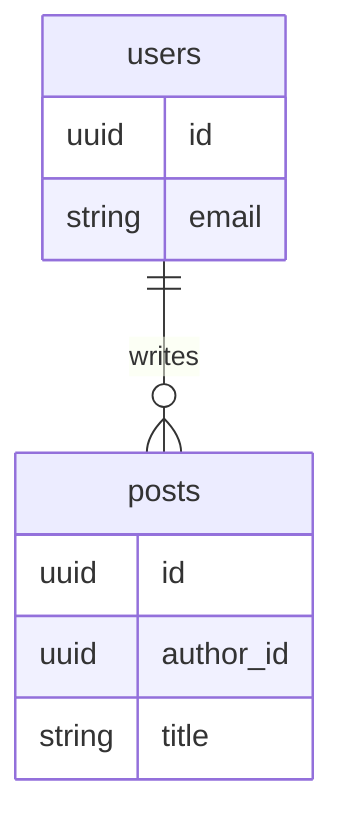
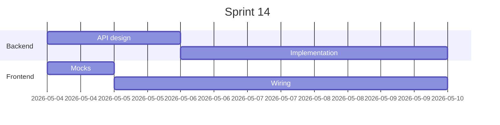
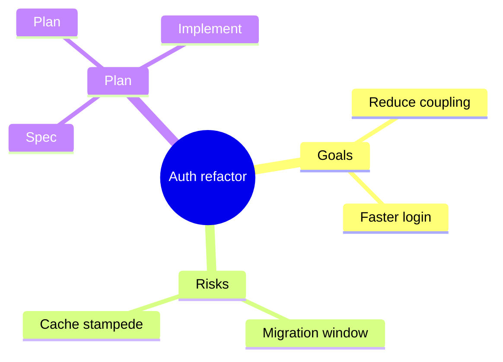
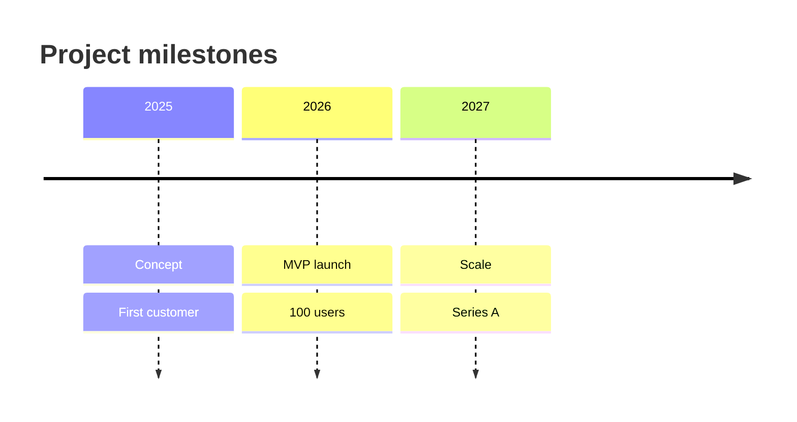
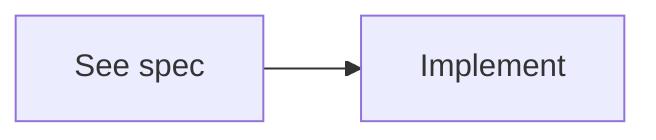

# Obsidian Diagrams

Use this skill alongside `obsidian-mcp-tools` (which carries the MCP-tool decision matrix). This skill adds the diagram-format decision: when to reach for Mermaid, when for JSON Canvas, and when to point the user at Excalidraw. Examples cover only vanilla Obsidian — no third-party plugins assumed.

## Why this skill exists

Without this skill, agents conflate diagram formats — embedding a Mermaid block when a JSON Canvas would actually link to other notes, or generating experimental Mermaid syntax that vanilla Obsidian does not render. With it, the format choice is determined by the question being asked, the templates are vetted against vanilla Obsidian (Mermaid v11.4.1), and every `.canvas` file is built against the official JSON Canvas 1.0 spec with a validation checklist.

## Decision matrix

| Want to… | Use | Why |
|---|---|---|
| Embed flowchart, sequence, state, ER, gantt, mindmap, timeline, or class diagram inside a single note | **Mermaid** | Text in markdown, git-diff-friendly, zero plugins needed, renders in vanilla Obsidian preview. |
| Build a visual map across multiple notes/ideas with file-link nodes | **JSON Canvas** | Native `.canvas` format; nodes can reference real `.md` files in the vault and open them in place. |
| Hand-drawn whiteboard look, brainstorm sketches, presentation visuals | **Excalidraw** (separate MCP) | Aesthetic, manual layout. Requires `debu-sinha/excalidraw-mcp-server`; details out of scope here. |

Tiebreakers when two formats could fit:

- **Embedded vs standalone.** Mermaid lives inside a note; Canvas is its own file. If the diagram is conceptually part of the note, choose Mermaid.
- **Auto-layout vs spatial.** Mermaid auto-lays-out from text; Canvas is manual XY positioning. Auto-layout wins for changing structures (you re-edit text); manual wins when you need precise placement.
- **File linking.** Only Canvas nodes can be `type: file` and open real vault notes inside the canvas. If the user wants a "map of my notes", Mermaid cannot deliver — go Canvas.
- **Diff/review.** Mermaid is plain text and reviewable in PRs; Canvas JSON is harder to diff. For docs that go through review, prefer Mermaid where possible.

## Mermaid via obsidian MCP

Append a Mermaid block to a note with `mcp__obsidian__obsidian_append_content`:

```python
obsidian_append_content(
    filepath="docs/Auth flow.md",
    content="\n\n## Flow\n\n```mermaid\nflowchart LR\n  A[Login] --> B{Valid?}\n  B -->|yes| C[Issue token]\n  B -->|no| D[Reject]\n```\n"
)
```

> ⚠️ **Vanilla constraint.** Obsidian ships Mermaid **v11.4.1**. Avoid features documented as v11.5+ (e.g., new animation directives, latest mindmap syntax extensions). Stick to the templates below — they all render in vanilla Obsidian.

### 1. flowchart — process flow

Use for: linear or branching processes, decision trees, build/CI pipelines.



### 2. sequenceDiagram — interactions across actors

Use for: API requests, message flows, who-talks-to-whom.



### 3. classDiagram — types and relationships

Use for: domain models, type hierarchies.



### 4. stateDiagram-v2 — lifecycles

Use for: order/ticket/job state machines, UI screens.



### 5. erDiagram — relational schemas

Use for: database tables and FKs.



### 6. gantt — timelines with durations

Use for: sprints, project plans, parallel tracks.



### 7. mindmap — hierarchies

Use for: research topic breakdowns, brainstorming roots.



### 8. timeline — chronology

Use for: roadmaps, historical event sequences.



### Wikilinks inside Mermaid

Obsidian's Mermaid integration recognizes the `internal-link` class to make a node link to a vault note (an Obsidian-specific extension on top of vanilla Mermaid syntax — works in vanilla Obsidian without any plugin):



Click `A` in preview to open the vault note named `See spec`.

## JSON Canvas via obsidian MCP

`.canvas` files are JSON per the [JSON Canvas 1.0 spec](https://github.com/obsidianmd/jsoncanvas/blob/main/spec/1.0.md). Write them with `obsidian_append_content` (creates the file). `.canvas` files have **no frontmatter** — pure JSON.

### Spec recap

Top level:

```json
{ "nodes": [], "edges": [] }
```

**Node** — required: `id` (16-char hex), `type` (`text`|`file`|`link`|`group`), `x`, `y`, `width`, `height`. Optional: `color` (preset `"1"`–`"6"` or hex `"#RRGGBB"`).

Type-specific required fields:
- `text` nodes → `text` (Markdown allowed)
- `file` nodes → `file` (vault-relative path); optional `subpath` (e.g. `#Heading`)
- `link` nodes → `url`
- `group` nodes → optional `label`

**Edge** — required: `id`, `fromNode`, `toNode`. Optional: `fromSide`/`toSide` (`top|right|bottom|left`), `fromEnd`/`toEnd` (`none|arrow`, default `arrow` on `toEnd`), `color`, `label`.

### ID generation

16-char lowercase hex (64-bit random):

```javascript
// Node
const id = require('crypto').randomBytes(8).toString('hex');
```

```python
# Python
import secrets
node_id = secrets.token_hex(8)
```

### Pattern 1: Pure idea map

Three text nodes connected with labeled arrows. Use when the canvas is purely conceptual — no link to existing notes.

```json
{
  "nodes": [
    {"id": "a1b2c3d4e5f60718", "type": "text", "x": 0,    "y": 0, "width": 240, "height": 80, "text": "Problem"},
    {"id": "f1e2d3c4b5a69788", "type": "text", "x": 320,  "y": 0, "width": 240, "height": 80, "text": "Hypothesis"},
    {"id": "0011223344556677", "type": "text", "x": 640,  "y": 0, "width": 240, "height": 80, "text": "Test"}
  ],
  "edges": [
    {"id": "8899aabbccddeeff", "fromNode": "a1b2c3d4e5f60718", "toNode": "f1e2d3c4b5a69788", "label": "leads to"},
    {"id": "ffeeddccbbaa9988", "fromNode": "f1e2d3c4b5a69788", "toNode": "0011223344556677", "label": "validate via"}
  ]
}
```

### Pattern 2: File-linked map

Nodes that open real vault notes. **This is what makes Canvas unique** — Mermaid cannot do it.

```json
{
  "nodes": [
    {"id": "1234567890abcdef", "type": "file", "x": 0,   "y": 0, "width": 320, "height": 200, "file": "Projects/Auth Refactor/01 Overview.md"},
    {"id": "fedcba0987654321", "type": "file", "x": 400, "y": 0, "width": 320, "height": 200, "file": "Projects/Auth Refactor/02 Plan.md"}
  ],
  "edges": [
    {"id": "abcd1234abcd1234", "fromNode": "1234567890abcdef", "toNode": "fedcba0987654321", "label": "drives"}
  ]
}
```

### Pattern 3: Mixed map with group

Combine `text`, `file`, and a `group` container.

```json
{
  "nodes": [
    {"id": "aaaa1111aaaa1111", "type": "group", "x": -20, "y": -20, "width": 700, "height": 240, "label": "Active sprint"},
    {"id": "bbbb2222bbbb2222", "type": "text", "x": 0,   "y": 0,   "width": 300, "height": 100, "text": "Plan: 5 stories"},
    {"id": "cccc3333cccc3333", "type": "file", "x": 340, "y": 0,   "width": 300, "height": 100, "file": "Sprints/2026-W18.md"}
  ],
  "edges": [
    {"id": "dddd4444dddd4444", "fromNode": "bbbb2222bbbb2222", "toNode": "cccc3333cccc3333", "label": "lives in"}
  ]
}
```

### Validation checklist

Before considering a `.canvas` file done, verify:

1. JSON parses (e.g. `python3 -c "import json,sys; json.load(open(sys.argv[1]))" path.canvas`).
2. All `id` values are unique across **both** `nodes` and `edges`.
3. Every `fromNode`/`toNode` references an existing node `id`.
4. Required fields present per node type (`text` for text, `file` for file, `url` for link).
5. Enum values valid: `type`, `fromSide`/`toSide` (`top|right|bottom|left`), `fromEnd`/`toEnd` (`none|arrow`).
6. Colors are preset `"1"`–`"6"` or valid hex `"#RRGGBB"`.

### Pitfalls

- **Newlines in text nodes:** use `\n` inside the JSON string, never a literal newline.
- **No frontmatter:** `.canvas` files are pure JSON. Do not prepend YAML.
- **Do not use `obsidian_patch_content` on `.canvas` files** — heading-based patches do not apply to JSON. Use `obsidian_append_content` for create, or `obsidian_get_file_contents` + JSON edit + rewrite for updates.
- **Path relativity:** `file` paths in nodes are vault-relative (no leading `/`).

## Excalidraw via separate MCP server

Use Excalidraw when the user wants:
- Hand-drawn aesthetic (presentations, casual sketches).
- Free-form whiteboard layout.
- Manual control beyond Canvas's grid.

Vanilla Obsidian does not author Excalidraw. The recommended MCP server is [`debu-sinha/excalidraw-mcp-server`](https://github.com/debu-sinha/excalidraw-mcp-server) (16 tools: create_element, batch_create, group, align, mermaid→excalidraw, export SVG/PNG).

Install (illustrative — follow the repo README for the authoritative command):

```bash
claude mcp add --scope user excalidraw -- npx -y @debu-sinha/excalidraw-mcp-server
```

Boundary: this skill does not document the Excalidraw MCP tools. If installed, use them per their own descriptions. If not installed, suggest the user install it before proceeding.

## Anti-patterns

- ❌ Mermaid for cross-note maps when nodes need to link to actual vault files → use JSON Canvas with `type: file` nodes.
- ❌ JSON Canvas for an embedded chart inside a single note → use Mermaid (less overhead, embedded in markdown).
- ❌ Using experimental Mermaid syntax (animations, v11.5+ features) without verifying vanilla render — vanilla Obsidian is on v11.4.1.
- ❌ Writing `.canvas` files without parse-validating the JSON before considering the task done.
- ❌ Calling `obsidian_patch_content` on a `.canvas` file — patches target headings/blocks, but `.canvas` is JSON.

## Extends obsidian-conventions

> All rules from the `obsidian-conventions` skill (frontmatter for `.md` files, naming, append-vs-rewrite, atomicity) apply unchanged. This skill adds the diagram-specific layer on top. Notes embedding diagrams follow conventions; `.canvas` files have no frontmatter (pure JSON, per spec).
